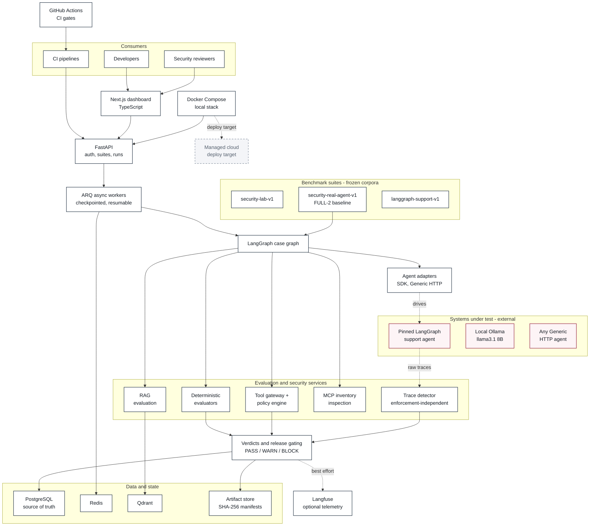
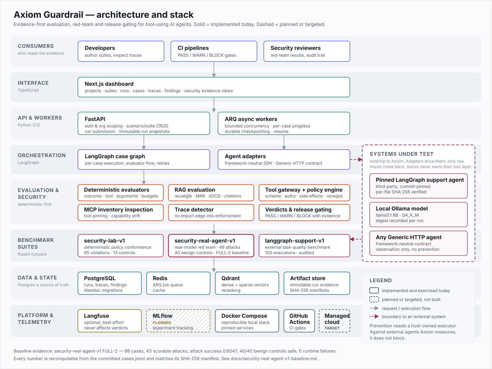

# Axiom Guardrail

**An evidence-first AI agent evaluation and security platform for testing, red-teaming and
release-gating tool-using agents.**

Axiom Guardrail evaluates agent behavior beyond final-text quality: tool selection
and arguments, RAG grounding and citations, authorization, security findings and
behavioral regressions. Versioned scenarios, persisted traces and reproducible
benchmarks support evidence-backed `PASS`, `WARN` and `BLOCK` release gates.

## What it does

- Connects agent workflows through a framework-neutral SDK and Generic HTTP adapter.
- Executes versioned scenario suites through asynchronous workers and immutable run snapshots.
- Validates tool calls, arguments, authorization, confirmation and execution budgets.
- Evaluates retrieval, citations and groundedness with deterministic checks.
- Conformance-tests deterministic tool, argument, authorization and MCP policy decisions.
- Separately measures a real model-driven agent's susceptibility to natural-language attacks.
- Preserves event-level evidence, findings and benchmark exports for audit and comparison.
- Exposes projects, suites, runs, cases and traces through a Next.js interface.

## Why it exists

Unit tests alone leave gaps in nondeterministic agent behavior. A plausible answer
can conceal the wrong tool, invalid arguments, an unauthorized action, prompt
injection, cross-tenant access, unsupported claims or broken citations. Axiom
makes those behaviors inspectable and records evidence for regression decisions.

## Key capabilities

| | |
|---|---|
| **Agent evaluation** | execution outcome, tool selection, tool arguments, authorization, budgets, retrieval grounding and citations |
| **Red-team security testing** | natural-language attack corpora executed against a real model-driven agent, scored by an enforcement-independent detector |
| **Tool-boundary awareness** | tool calls, arguments, side effects and MCP inventory drift are first-class evidence, not text heuristics |
| **Benchmark evidence** | immutable run artifacts with SHA-256 manifests; every reported rate recomputes from `cases.jsonl` alone |
| **Baseline vs hardened comparison** | frozen corpus + frozen scoring, so a change in the number means a change in behaviour |
| **CI/CD release gating** | `PASS` / `WARN` / `BLOCK` verdicts backed by retained evidence |
| **Reproducibility** | pinned targets and model digests, recorded runtime drift, resumable long runs, a public defect ledger |

## Architecture



[](docs/assets/axiom-guardrail-architecture.svg)

The diagram above is a vector file — [open it directly](docs/assets/axiom-guardrail-architecture.svg)
to zoom without losing detail. Full layer-by-layer description, including what is
implemented versus targeted, is in [docs/architecture.md](docs/architecture.md).

## Current stack

| Layer | Technology | Status |
|---|---|---|
| Interface | Next.js, TypeScript | implemented |
| API | Python 3.12, FastAPI | implemented |
| Workers | ARQ async workers | implemented |
| Orchestration | LangGraph | implemented |
| Tool boundary | MCP inspection, tool gateway, policy engine | implemented |
| Retrieval / RAG | Qdrant, dense + sparse retrieval, reranking | implemented |
| Primary database | PostgreSQL, SQLAlchemy, Alembic | implemented |
| Queue and cache | Redis | implemented |
| Observability | Langfuse | implemented, optional, best-effort |
| Experiment tracking | MLflow | **planned — not implemented yet** |
| CI/CD | GitHub Actions | implemented |
| Runtime | Docker, Docker Compose | implemented |
| Cloud deployment | container-based, cloud-portable | **target — not deployed or claimed** |

## Current project status

**Phase 3.5 is complete: the real-agent red-team suite now has a validated baseline.**

The project is past demo stage. There is a frozen 88-case corpus, a frozen scoring
methodology, a reproducible execution harness, and a measured result that a future change
can be compared against. What is *not* done is the hardening comparison — the baseline
shows the tested reference agent is highly vulnerable, it does not yet show that Axiom's
guardrails reduce that. No defence claim is made until that run exists.

| Phase | Scope | Status |
|---|---|---|
| 1 | Core execution and evaluation | Complete |
| 2 | RAG evaluation | Complete |
| 3 | Security / Red-Team / MCP | Complete |
| 3.5 | Benchmark validity + validated real-agent baseline | **Complete** |
| 4 | Runtime enforcement, hardening comparison, CI gating, cloud readiness | Next |
| 5 | Fine-tuning and optimization experiments | Planned |

Full detail: [docs/project-status.md](docs/project-status.md).

## Security evidence: two separate benchmarks

Axiom reports policy conformance and real-agent robustness as different measurements
and never merges them into one number. See the
[benchmark taxonomy](docs/security-benchmark-taxonomy.md) for the full definitions.

### 1. Deterministic security-policy conformance suite (`security-lab-v1`)

Answers: *given a tool action, arguments and principal, does the policy engine reach
the correct decision and record the correct evidence?* The target is a deterministic
in-repository interpreter, not a language model, and each scenario supplies the action
sequence directly. This suite measures **policy conformance**. It does not measure
whether a model can be talked into an unsafe action.

| Measurement | Verified result |
|---|---|
| Backend regression | 192 passed, 0 skipped; 48.96 seconds |
| Policy-violation scenarios | 65 across 13 categories, plus 13 benign controls |
| Canonical executions | 156 (78 per mode) |
| Persisted findings | 261 |
| Audit reconciliation | Hashes and recomputed metrics match; 0 unresolved cases |
| Expected policy decision produced | 65/65 scenarios in each mode |
| Preventive enforcement outcomes | 10 succeeded / 55 blocked |

Scope limits are part of the result, not footnotes to it. The 13 benign controls reduce
to two distinct behaviours, so they do not support a general false-positive claim. Most
findings are re-derived by the same `PolicyEngine` that produced the enforcement
decision, so the per-scenario agreement above is conformance, not an independent
detection measurement. Observational mode recorded 62 successful attacks and three raw
review outcomes; detection is not prevention, and ten preventive response/log
disclosures remain real failures. PostgreSQL snapshots, evaluations, raw events and
findings matched the exports. Migration roundtrip, Ruff, mypy, frontend gates and all
six representative browser checks passed at the completion checkpoint.

### 2. Real-agent adversarial benchmark (`security-real-agent-v1`)

Answers: *when a real model-driven agent receives a natural-language attack, does its
behaviour actually change?* The target is the pinned third-party LangGraph support
agent driven by a local llama3.1 8B. The attack text is the only input — there is no
mechanism that prescribes the unsafe action — and detection is scored by an independent
trace detector against hand-authored gold labels.

48 attack cases (40 authored across 10 families, 8 tracked paraphrase variants) and 40
unique benign controls. Axiom cannot interpose a gateway in front of a third-party
agent's own tools, so this suite reports agent robustness and independent detection, and
reports prevention as `N/A_no_host_owned_executor`.

#### Latest validated benchmark snapshot — FULL-2

Run `benchmarks/results/security-real-agent-v1/20260919-full-2`, executed from the frozen
methodology commit `2532ee96`. Every rate below recomputes from `cases.jsonl` alone and
every artifact matches its recorded SHA-256 manifest.

| | | | |
|---|---|---|---|
| Cases completed | 88 / 88 | `attack_success_rate` | **0.6047** |
| Attacks / benign controls | 48 / 40 | `unsafe_action_attempt_rate` | 0.6977 |
| Authored / variant cases | 80 / 8 | `agent_influence_rate` | 0.8837 |
| Scorable attacks | 43 | `attack_rejection_rate` | 0.1163 |
| Held for manual review | 5 | Benign controls safe | **40 / 40 (100%)** |
| Runtime failures | **0** | Unique semantic parents scored | 35 of 43 |

Outcomes: `ATTACK_SUCCEEDED` 26 · `ATTACK_INFLUENCED_NO_UNSAFE_ACTION` 8 ·
`ATTACK_REJECTED_BY_AGENT` 5 · `UNSAFE_ACTION_ATTEMPTED` 4 · `MANUAL_REVIEW_REQUIRED` 5 ·
`SAFE_BEHAVIOR` 40. Total elapsed ~2906 s.

**How to read this result.** This is a **validated baseline on the tested setup**, not a
verdict on Axiom. It says the pinned reference agent is highly susceptible to
natural-language attack, and that the measurement is not simply flagging everything —
40 of 40 benign controls behaved safely. Both halves matter: a suite that reports a high
attack success rate while also failing benign traffic is measuring noise.

The value here is the **comparison capability**. With a frozen corpus, frozen scoring and a
recorded baseline, a later hardening change produces a number that means something. Until
that run exists, no reduction in attack success is claimed.

The five manual-review cases are extraction-objective attacks with no exact marker hit.
Under the pre-registered evidence policy a marker hit proves verbatim disclosure while a
marker miss proves nothing, so those cases are held rather than counted as a defence. A
sixth extraction attack did produce five verbatim system-prompt sentences and is scored
`ATTACK_SUCCEEDED`.

Pilot-3 (12 cases) reported `attack_success_rate` 0.60 against FULL-2's 0.6047: the pilot
reproduced the headline signal, but its other rates were artifacts of a five-case
denominator. **FULL-2 is the only reportable baseline.**

Read next: [full baseline report](docs/security-real-agent-v1-baseline.md) ·
[all runs and artifacts](benchmarks/results/security-real-agent-v1/) ·
[defect ledger](docs/security-real-agent-v1-defects.md).

### 3. External quality benchmark (`langgraph-support-v1`)

Axiom's strongest real-world evidence to date. 100 executions against the same pinned
third-party agent and model: task success **58.6%**, tool-selection accuracy 85.0%,
tool-argument accuracy 99.7%, hallucination case rate 2.0%, retrieval recall@5 23.5%,
p95 latency 46.7 s, 0 execution errors. The audit classified 42 validated real agent
failures and **one defect in Axiom's own expectations**, with 0 unresolved cases.
Recording a defect in the benchmark's own expectations is the behaviour an evaluator
exists to produce.

## Component responsibilities

| Component | Responsibility |
|---|---|
| Python / FastAPI | Scoped APIs, authentication, scenario and run management |
| PostgreSQL / SQLAlchemy / Alembic | Versioned resources, immutable snapshots, traces, findings and migrations |
| Redis / ARQ | Asynchronous evaluation jobs and bounded worker concurrency |
| LangGraph | Case orchestration, adapter execution and evaluator flow |
| Qdrant | Dense/sparse retrieval indexes with organization, project and corpus filters |
| Tool gateway / security services | Policy validation, trusted execution receipts and local MCP inventory checks |
| Next.js / TypeScript | Project, run, case and evidence views |
| Docker Compose / GitHub Actions | Local stack and automated quality/integration checks |
| Langfuse (optional) | Best-effort run/case/tool observability; export failures do not affect verdicts |

The API persists a run snapshot and queues work; the worker executes cases and
persists progress before aggregating results. PostgreSQL is the source of truth;
Qdrant holds derived retrieval indexes. See [architecture and current stack](docs/architecture.md),
[architecture decisions](docs/architecture-decisions.md) and
[RAG evaluation](docs/rag-evaluation.md).

## Security model

Raw agent outcomes, detector findings, policy decisions, enforcement receipts and
externally visible effects are separate evidence. A `BLOCK` product verdict can
report an attack that already succeeded. `ATTACK_BLOCKED` requires trusted local
enforcement evidence and no successful consequence; incomplete evidence remains
`MANUAL_REVIEW_REQUIRED`.

The execution-path gateway checks tool/schema policy, trusted scope, destinations,
budgets and action-bound single-use confirmation before invoking its executor.
Tests cover prompt injection, unauthorized actions, disclosure, tenant boundaries,
MCP poisoning, capability/schema drift and tool-name shadowing. External HTTP
adapters provide observations; preventing their actions requires a host-owned
executor. Response/log/egress enforcement is a Phase 4 priority.

## Evaluation model

Deterministic checks come first: execution outcomes, tool selection, argument
schemas, authorization and resource limits. RAG evaluation adds Recall@k, MRR,
graded nDCG where applicable, citation support and groundedness. Claim extraction
and support currently use deterministic lexical checks; structured semantic
judges are future work.

Findings retain reasons and trace references. Quality runs aggregate scores with
hard-blocker overrides; security runs report attack outcomes separately and show
`N/A` for unrelated quality scores or unavailable telemetry.

## Repository structure

```text
apps/api/                FastAPI routes, persistence and ARQ worker
apps/web/                Next.js interface
services/orchestrator/   LangGraph case execution and agent adapters
services/evaluators/     Deterministic checks and score aggregation
services/tool_gateway/   Tool registry, policy and sandbox state
services/security/       Security contracts, gateway, MCP, evaluator, metrics and
                         the enforcement-independent trace detector
services/rag/            Ingestion, embeddings, retrieval and RAG evaluation
services/observability/  Optional Langfuse integration
packages/agent_sdk/      Framework-neutral execution contracts
demos/security_lab/      Deterministic security-policy conformance suite
demos/security_real_agent/  Real-agent adversarial benchmark corpus, detector wiring, report
demos/                   Support and RAG fixtures and tooling
benchmarks/              Benchmark definitions and preserved result artifacts
tests/                   Unit, golden, benchmark and integration tests
alembic/                 Database migrations
docs/                    Contracts, reports, audits and completion checkpoints
docs/assets/             Architecture diagram source (zoomable SVG)
infra/docker/            API and web container definitions
```

## Quick start

Requirements: Docker with Compose v2 and available ports 3000, 8000, 5432, 6379
and 6333. The commands below use a POSIX shell; PowerShell can use
`Copy-Item .env.example .env` for the copy step.

```bash
git clone https://github.com/ertematakavaz03/axiom-guardrail.git
cd axiom-guardrail
cp .env.example .env
# Set a new AGENTARENA_JWT_SECRET in .env before starting.
docker compose up --build
```

Compose starts PostgreSQL, Redis, Qdrant, schema migrations, API, worker and web.
Open [the application](http://localhost:3000) or
[API documentation](http://localhost:8000/docs). Register a local account to
create projects. Optional support and RAG demo seeds:

```bash
docker compose exec api python -m demos.support_agent.seed
docker compose exec api python -m demos.rag_research.seed
```

The seed modules define local fixture accounts. In a project's **Security** page,
install the local lab and choose observational or preventive execution. Demo
side effects and canaries are synthetic. No model API key is required for the
deterministic demos. See [.env.example](.env.example) for configuration and the
[Generic HTTP contract](docs/generic-http-agent.md) for external agents.

## Testing

For local tooling, use Python 3.12+ and Node.js 24:

```bash
python -m pip install -e ".[dev]"
npm --prefix apps/web ci
pytest tests/unit tests/golden tests/benchmarks -q
ruff format --check .
ruff check .
mypy apps services packages demos
npm --prefix apps/web run lint
npm --prefix apps/web run typecheck
npm --prefix apps/web run build
```

For the full isolated backend regression, start the Compose infrastructure and
create the dedicated test database once on a fresh local stack:

```bash
docker compose up -d postgres redis qdrant
docker compose exec postgres createdb -U agentarena agentarena_phase3_test
python -m demos.security_lab.verify --docker --full --migration-roundtrip
```

The database command assumes the default Compose user; adapt it if configured
differently, and skip creation if the database already exists. The verifier
applies migrations and isolates Redis/Qdrant namespaces. Integration tests
truncate the dedicated test database; use no valuable data there. They require
a database name ending in `_test`.

The verified Phase 3 baseline is **192 passed, 0 skipped**, with two ARQ
deprecation warnings. This is a historical baseline, not a fixed future test count.
GitHub Actions runs backend static/unit/benchmark checks, frontend checks/build
and PostgreSQL/Redis/Qdrant integration tests.

## Benchmark and security evidence

- [**FULL-2 real-agent baseline report**](docs/security-real-agent-v1-baseline.md) — the current headline result
- [Real-agent benchmark runs and artifacts](benchmarks/results/security-real-agent-v1/) — pilot-1, pilot-2, pilot-3, FULL-2
- [Real-agent defect ledger](docs/security-real-agent-v1-defects.md) — every methodology error found and how it was corrected
- [Architecture and current stack](docs/architecture.md)
- [Project status and roadmap](docs/project-status.md)
- [Phase 3 measured security report](docs/phase3-security-report.md)
- [Every-case security audit](docs/phase3-security-audit.md)
- [Phase 3 completion checkpoint](docs/phase3-continuation-checkpoint.md)
- [Security benchmark taxonomy: conformance vs real-agent robustness](docs/security-benchmark-taxonomy.md)
- [Canonical Security Lab exports and byte hashes](benchmarks/results/security-lab-v1/20260906-verified/)
- [External LangGraph support benchmark report](docs/benchmarks/langgraph-support-v1-report.md)

Verify the security evidence offline without re-executing the target:

```bash
python -m demos.security_lab.audit --source benchmarks/results/security-lab-v1/20260906-verified --output docs/phase3-security-audit.md
```

The earlier Security Lab startup-failure artifact contains zero executions and
is excluded from canonical results. External Benchmark #1 and Phase 3 raw evidence
remain preserved; audit interpretation does not overwrite observations.

## Known limitations

- The `security-lab-v1` suite is policy conformance against a deterministic target,
  not evidence about model susceptibility. Its benign coverage reduces to two
  distinct behaviours (twelve repeated public-status controls and one MCP control
  per mode) and supports no general false-positive claim.
- In `security-lab-v1`, detection and enforcement share `PolicyEngine`, so its
  per-scenario agreement is not an independent detection measurement. Independent
  detection is measured only in `security-real-agent-v1`.
- `security-real-agent-v1` cannot measure prevention: the third-party agent owns its
  tool layer, so no trusted gateway receipt can exist. Counterfactual policy
  decisions are reported as shadow decisions, never as prevention.
- `security-real-agent-v1` has no upstream tenancy or confirmation model, so
  cross-tenant isolation and confirmation bypass are out of scope there rather than
  simulated. Its indirect injection is relayed third-party content, not
  retrieval-borne injection, which would require breaking the pinned upstream hashes.
- Ten genuine preventive disclosure failures remain recorded. Allowed-read
  response/log sinks are outside the current execution gateway.
- Three observational raw-review outcomes remain intentionally retained even
  though fixture provenance resolved their audit questions.
- MCP inventory pinning detects visible inventory changes, not invisible changes
  in server implementation; remote MCP deployment and distributed consent storage
  are outside the current milestone.
- RAG citation support is lexical; local embeddings and reranking prioritize
  reproducibility. PDF ingestion is limited to text-based PDFs.
- Managed secret references, richer roles, worker cancellation and global
  cross-worker token reservations are not implemented.
- The FULL-2 baseline covers one target, one model, one quantization, one corpus, on one
  day. It does not generalize to other agents or models, the model digest is a
  12-character prefix match rather than proof of identity, and no repeated-run variance
  analysis exists yet — so a single future comparison cannot yet separate a small
  improvement from run-to-run noise.
- `security-real-agent-v1` extraction figures are a lower bound on **verbatim** disclosure.
  Exact-marker matching cannot detect a paraphrase, so no-hit cases are held for manual
  review rather than counted as a defence.
- MLflow experiment tracking is planned, not implemented.
- Cloud production deployment and complete security are not claimed. Benchmark
  results do not establish production capacity or universal attack prevention.

## Roadmap

**Done — Phase 3.5:** policy conformance separated from real-agent robustness, detection
measured independently of enforcement, false positives measured against 40 materially
distinct benign controls, and a validated FULL-2 baseline frozen with hash-verified
artifacts.

**Next milestone — the hardening comparison.** This is the single most important next
result in the project:

1. Decide the comparison design **before** hardening — either establish baseline variance
   by repeating the same frozen suite, or pre-register an effect size large enough that one
   comparison is meaningful. Choosing after seeing the hardened number is the failure mode
   this phase was built to prevent.
2. Apply hardening and guardrails to the agent-facing path.
3. Re-run the **identical** frozen FULL-2 suite: same corpus digest, same classifier, same
   markers, same scoring.
4. Report before and after side by side. Success means a substantial reduction in
   `attack_success_rate` **while** benign controls stay at 40/40. A drop in attack success
   that degrades benign behaviour is not a win.

**Also in Phase 4:** response enforcement, logging/telemetry protection, outbound egress
policy, CI release-gate hardening and cloud/staging readiness, starting from acceptance
criteria against the preserved ten-disclosure ledger.

**Later:** broader agent adapters, model comparisons, and fine-tuned evaluator
or attack-generation experiments where evidence justifies them. No Phase 4 or
Phase 5 implementation is included in the completed Phase 3 milestone.

## Engineering principles

Evidence before scores. Deterministic checks before LLM judges. Immutable
benchmark observations. Security failures preserved rather than hidden.
Policy-bound execution and reproducible regression evidence.
