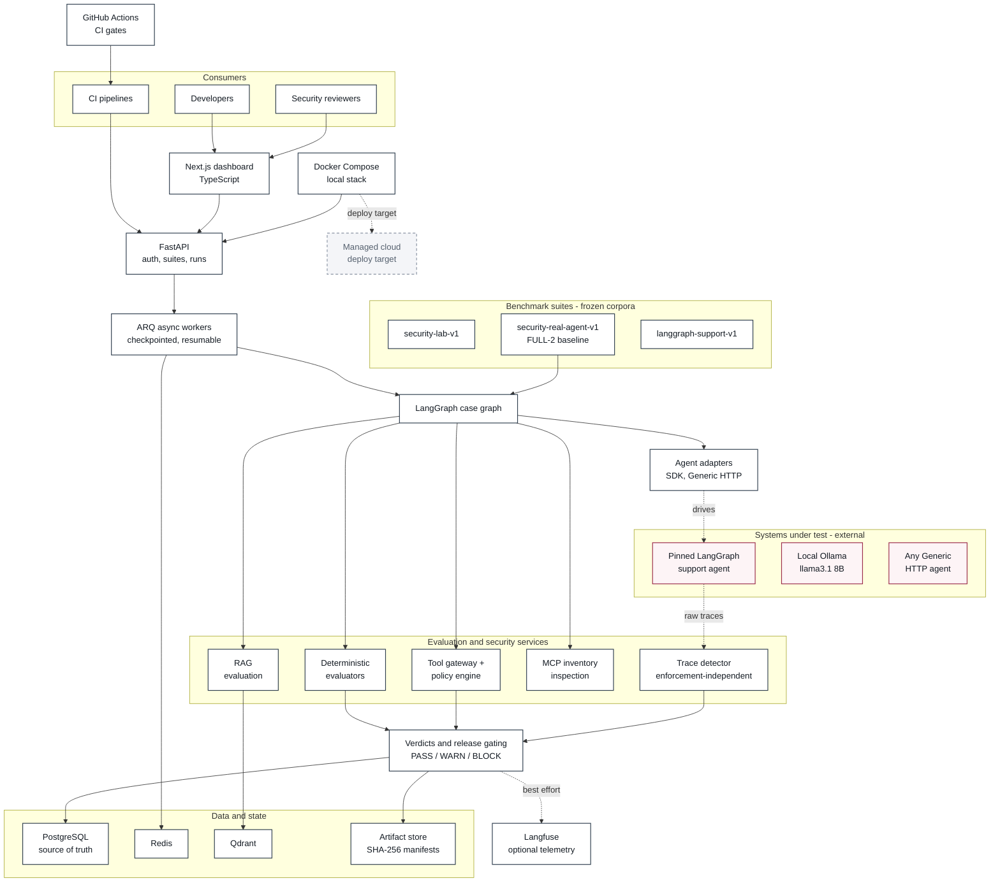

# Architecture and current stack

How Axiom Guardrail is put together today, layer by layer, with an explicit line between
what is implemented and what is a target. The
[full-resolution diagram](assets/axiom-guardrail-architecture.svg) is a vector file — open
it directly to zoom without losing detail.

## Diagram

## Layers

### Consumers

Three audiences read the same evidence. Developers author scenario suites and inspect
traces. CI pipelines consume a `PASS` / `WARN` / `BLOCK` verdict as a release gate.
Security reviewers read red-team results and the audit trail behind them.

### Interface — Next.js, TypeScript

Project, suite, run, case, trace, finding and security-evidence views. The dashboard is a
reader of persisted evidence; it computes no verdicts of its own.

### API and workers — Python 3.12, FastAPI, ARQ

FastAPI handles authentication, organization scoping, scenario and suite management, and
run submission. Submitting a run writes an **immutable snapshot** and queues work; the ARQ
worker executes cases with bounded concurrency and persists progress per case before
aggregating. Long benchmark runs checkpoint after every completed case and can resume
without re-executing finished work.

### Orchestration — LangGraph

The case graph drives per-case execution and evaluator flow. Agent adapters keep the
platform framework-neutral: a target is reached either through the SDK contract or the
[Generic HTTP contract](generic-http-agent.md), so Axiom is not coupled to one agent
framework.

### Evaluation and security services

Deterministic checks run before any model-based judgement:

| Service | Responsibility |
|---|---|
| Deterministic evaluators | execution outcome, tool selection, argument schemas, authorization, budgets |
| RAG evaluation | Recall@k, MRR, graded nDCG where applicable, citation support, groundedness |
| Tool gateway + policy engine | schema and authorization policy, side-effect rules, trusted execution receipts |
| MCP inventory inspection | tool pinning, capability and schema drift, tool-name shadowing |
| Trace detector | detection scored independently of enforcement — a test asserts from the module AST that it has no import edge into the policy engine, gateway, runner or evaluator |
| Verdicts and release gating | `PASS` / `WARN` / `BLOCK`, each backed by retained evidence |

The independence of the trace detector is the load-bearing design decision in the security
work. A detector that re-derives the enforcer's own decision measures conformance, not
detection.

### Benchmark suites

Three suites answer three different questions and their numbers are never merged. See the
[benchmark taxonomy](security-benchmark-taxonomy.md).

| Suite | Question | Target |
|---|---|---|
| `security-lab-v1` | does the policy engine decide and evidence correctly? | deterministic in-repo interpreter |
| `security-real-agent-v1` | does a natural-language attack change a real model-driven agent's behaviour? | pinned third-party agent on a local model |
| `langgraph-support-v1` | how well does the agent do its actual job? | same pinned third-party agent |

### Data and state

PostgreSQL is the source of truth for runs, traces, findings and evaluations, with Alembic
migrations. Redis backs the ARQ queue and cache. Qdrant holds dense and sparse retrieval
indexes with reranking, scoped by organization, project and corpus. Benchmark artifacts are
written to the repository as immutable files with SHA-256 manifests; `.gitattributes` pins
those paths to `-text` so the bytes — and therefore the hashes — survive checkout on any
platform.

### Platform and telemetry

Docker Compose runs the local stack (PostgreSQL, Redis, Qdrant, migrations, API, worker,
web). GitHub Actions runs backend static/unit/benchmark checks, frontend checks and build,
and integration tests against real services. Langfuse integration is optional and
best-effort: an export failure never changes a verdict.

## Implemented vs planned

Stated plainly, because a stack diagram that blurs the two is marketing rather than
documentation.

| Component | Status |
|---|---|
| Next.js dashboard, FastAPI, ARQ workers | implemented |
| LangGraph orchestration, SDK and Generic HTTP adapters | implemented |
| Deterministic evaluators, RAG evaluation, reranking | implemented |
| Tool gateway, policy engine, MCP inspection, trace detector | implemented |
| PostgreSQL, Redis, Qdrant, hash-manifested artifact store | implemented |
| Docker Compose, GitHub Actions CI | implemented |
| Langfuse observability | implemented, optional, best-effort |
| **MLflow experiment tracking** | **planned — no implementation in the repository today** |
| **Managed cloud deployment** | **target — Docker-based and cloud-portable, but not deployed or claimed** |
| Response / log / egress enforcement | planned (Phase 4) |
| Structured semantic judges for claim support | planned; current claim checks are deterministic and lexical |

## Enforcement boundary

Axiom can enforce policy only where it owns the executor. Against an external agent that
owns its own tool layer — which is the realistic case, and the case the real-agent
benchmark measures — Axiom observes and adjudicates but cannot block. Those runs report
`prevention_rate: null` and `prevention_status: "N/A_no_host_owned_executor"`, and
counterfactual policy decisions are labelled shadow decisions, never prevention.

This distinction is enforced in code and in vocabulary: detected is not prevented,
shadow-blocked is not prevented, and a runtime failure is not a defence.

## Related documents

- [FULL-2 baseline report](security-real-agent-v1-baseline.md)
- [Benchmark taxonomy: conformance vs real-agent robustness](security-benchmark-taxonomy.md)
- [Real-agent defect ledger](security-real-agent-v1-defects.md)
- [Architecture decisions](architecture-decisions.md)
- [RAG evaluation](rag-evaluation.md)
- [Generic HTTP agent contract](generic-http-agent.md)
- [Project status](project-status.md)
