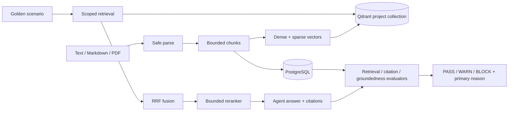

# RAG evaluation

Phase 2 evaluates whether an agent retrieved the right tenant-scoped evidence, cited it correctly, and kept factual claims grounded in that evidence. PostgreSQL is authoritative; Qdrant is a rebuildable dense/sparse search index.

## Data and retrieval flow

Every Qdrant point contains immutable `chunk_id`, `document_id`, and `document_version_id` references plus organization, project, corpus, locale, version, effective-date, and trust metadata. Collection-per-project isolation is combined with mandatory organization/project/corpus payload filters. Optional user filters are mapped through an allow-list and cannot replace tenant filters.

## Ingestion

The JSON endpoint accepts UTF-8 text or Markdown. Multipart upload accepts `.txt`, `.md`, and text-based `.pdf`. Filename normalization, MIME/signature validation, a maximum byte limit, and no-text rejection run before persistence. PDFs do not use OCR.

Content is hashed with SHA-256. Re-ingesting identical content returns the existing version and chunks instead of duplicating records. New content creates an immutable version; chunk and Qdrant point IDs are stable UUID5 values derived from document ID, content hash, and chunk index. Chunk size and overlap are configurable.

## Retrieval and reranking

Dense and sparse queries run concurrently with fixed candidate limits and a common timeout. Reciprocal Rank Fusion combines their ranks without pretending the two score scales are comparable. A configurable reranker receives only the bounded fused set and returns the final evidence set. All stages and latencies are written to the case trace.

## Gold evidence and retrieval metrics

A scenario may reference one or more gold documents, document versions, or chunks. Required evidence drives Recall@1, Recall@3, Recall@5, reciprocal rank, and gold-evidence hit rate. nDCG is computed only when the suite supplies meaningful graded relevance. Missing applicability is `null`/`N/A`, not zero, and run aggregation only averages present values.

`GOLD_EVIDENCE_NOT_RETRIEVED` means retrieval completed but omitted required evidence. `STALE_SOURCE_USED` means the agent/retriever used an older version when the scenario requires a newer one. Qdrant timeout or availability failures remain retrieval root causes and take precedence over downstream evidence misses.

## Citations and groundedness

Agents return structured claims and citations in the framework-neutral execution contract. Citation existence checks that cited chunk IDs are in the selected evidence. Citation support compares each factual claim with its cited chunk; citation precision and recall summarize supported/emitted and supported/factual relationships. Groundedness is the fraction of factual claims supported by selected evidence.

The evaluation is deterministic. It catches wrong/missing citations and clear contradictions such as a `30 days` answer against a `14 days` source, but it is not a general semantic judge. Unsupported factual claims yield `UNSUPPORTED_CLAIM`; a critical scenario blocks the run.

## Demo acceptance cases

`python -m demos.rag_research.seed` idempotently creates the RAG Research project, versioned Company Policies corpus, Hybrid deterministic retrieval config, agent, and 32 scenarios. The suite includes:

- evidence says 14 days while the answer says 30 days: retrieval and citation existence pass; citation support and groundedness fail; primary `UNSUPPORTED_CLAIM`;
- correct gold evidence absent from final hits: primary `GOLD_EVIDENCE_NOT_RETRIEVED`;
- v1 says 30 days while required v2 says 14 days: primary `STALE_SOURCE_USED`;
- any cross-tenant point returned despite mandatory scope: `RAG_TENANT_SCOPE_VIOLATION`, always `BLOCK`.

## Operations and limitations

The `/health` endpoint checks PostgreSQL, Redis, and Qdrant. Docker Compose health-gates API and worker startup on all three. Default local embeddings and reranking are reproducible rather than state-of-the-art. OCR, layout-aware PDF extraction, asynchronous large-corpus ingestion, deletion reconciliation, multilingual analyzers, semantic judges, MCP, MLflow, and cloud deployment are outside Phase 2.
